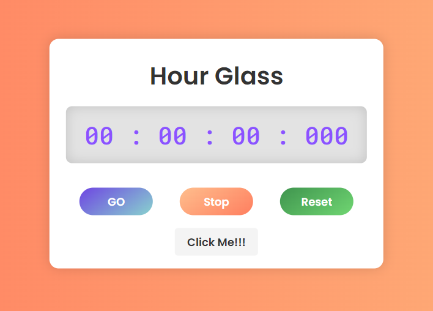

# Stylish Stopwatch Web Interface

A simple yet elegant stopwatch web application built using HTML, CSS, and JavaScript. This project is perfect for learning basic web development concepts, including DOM manipulation, event handling, and responsive design for a StopWatch/

.

## Features

- **Start**, **Pause**, and **Reset** functionality.
- Displays time in hours, minutes, seconds, and milliseconds.
- Attractive and responsive design with a modern look.
- GitHub link included for easy access to the project repository.

## Live Demo

Check out the live demo of the project [here](https://kushagrakumar04.github.io/stopWatch/)

## Installation

1. Clone the repository to your local machine:

   ```bash
   git clone [https://github.com/KushagraKumar04/stopWatch]
